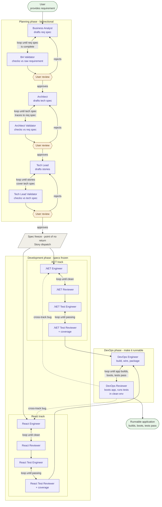

# Agentic SDLC Marketplace

A Claude Code plugin marketplace containing the **agentic-sdlc** plugin — a multi-agent SDLC pipeline that takes a plain-language requirement and produces a runnable .NET + React application.

## Pipeline overview



## Install

```
/plugin marketplace add ecogs-sys/Agentic.SDLC
/plugin install agentic-sdlc@agentic-sdlc-marketplace
```

See [`plugins/agentic-sdlc/README.md`](plugins/agentic-sdlc/README.md) for usage.

## Repository structure

```
.claude-plugin/
  marketplace.json           ← marketplace manifest
plugins/
  agentic-sdlc/
    .claude-plugin/
      plugin.json            ← plugin manifest (name, version)
    agents/                  ← 16 subagent definitions
    skills/                  ← 8 reusable skill files
    commands/                ← 4 slash commands
    README.md                ← plugin user documentation
CHANGELOG.md
LICENSE
```

## Local development (testing without publishing)

```
/plugin marketplace add .
/plugin install agentic-sdlc@agentic-sdlc-marketplace
```

After making changes:
```
/plugin uninstall agentic-sdlc@agentic-sdlc-marketplace
/plugin install agentic-sdlc@agentic-sdlc-marketplace
```

## Contributing

1. Edit files in `plugins/agentic-sdlc/`.
2. Bump `version` in `plugins/agentic-sdlc/.claude-plugin/plugin.json`.
3. Add an entry to `CHANGELOG.md`.
4. Commit and tag the release (`v0.x.0`).
5. Push to GitHub.
