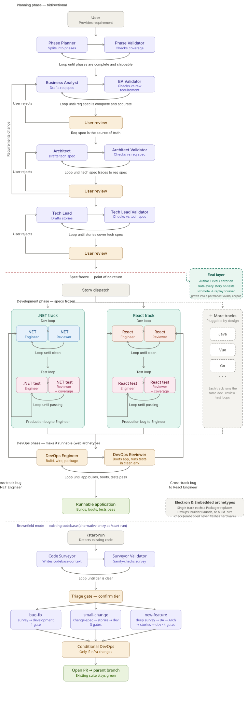
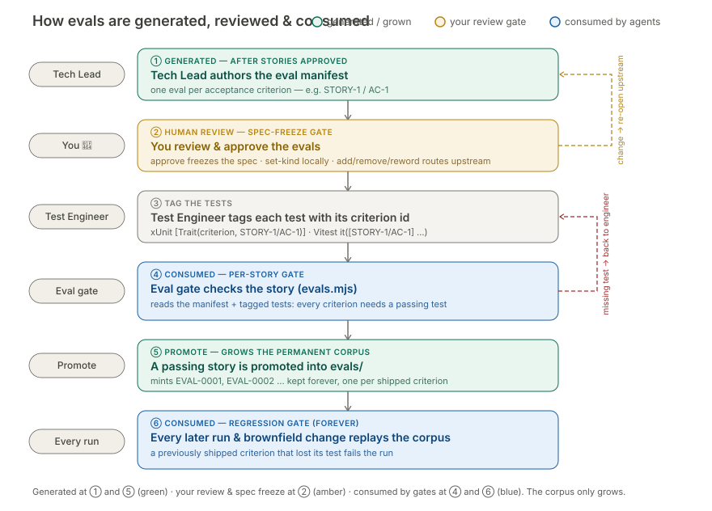

# Agentic SDLC Marketplace

A Claude Code plugin marketplace containing the **agentic-sdlc** plugin — a multi-agent SDLC pipeline that takes a plain-language requirement and produces a runnable .NET + React application. The pipeline supports both **greenfield** builds (from scratch, driven by a multi-phase program plan) and **brownfield changes** (bug fixes, small changes, and new features on an existing codebase, auto-detected at `/start-run`).

## Pipeline overview



## The eval layer — where evals come from and who uses them

An **eval** is a machine-checkable link between one acceptance criterion and the test
that proves it. The pipeline builds evals as it works and keeps them **forever**, so
the suite of guarantees grows with every feature and catches regressions on every
later run. If you read one picture, read this one:



- **Generated** (green) at two points: the **Tech Lead** writes one eval per
  acceptance criterion at spec freeze, and each passing story is **promoted** into a
  permanent `evals/` corpus (`EVAL-0001`, `EVAL-0002`, …).
- **Consumed** (blue) by two gates: the per-story **eval gate** blocks a story until
  every criterion has a passing tagged test, and **every later run** replays the
  whole corpus so a previously shipped criterion that lost its test fails the run.
- **Zero duplication:** evals don't re-implement tests — the **Test Engineer** tags
  each test with its criterion id (xUnit `[Trait]` / Vitest title token) and the
  corpus is *derived* from those tags. See the `write-evals` skill for details.

## Install

```
/plugin marketplace add ecogs-sys/Agentic.SDLC
/plugin install agentic-sdlc@agentic-sdlc-marketplace
```

See [`plugins/agentic-sdlc/README.md`](plugins/agentic-sdlc/README.md) for usage.

## Repository structure

```
.claude-plugin/
  marketplace.json           ← marketplace manifest
plugins/
  agentic-sdlc/
    .claude-plugin/
      plugin.json            ← plugin manifest (name, version)
    agents/                  ← 18 subagent definitions
    skills/                  ← 10 reusable skill files
    commands/                ← 5 slash commands
    README.md                ← plugin user documentation
CHANGELOG.md
LICENSE
```

## Local development (testing without publishing)

```
/plugin marketplace add .
/plugin install agentic-sdlc@agentic-sdlc-marketplace
```

After making changes:
```
/plugin uninstall agentic-sdlc@agentic-sdlc-marketplace
/plugin install agentic-sdlc@agentic-sdlc-marketplace
```

## Contributing

1. Edit files in `plugins/agentic-sdlc/`.
2. Bump `version` in `plugins/agentic-sdlc/.claude-plugin/plugin.json`.
3. Add an entry to `CHANGELOG.md`.
4. Commit and tag the release (`v0.x.0`).
5. Push to GitHub.
