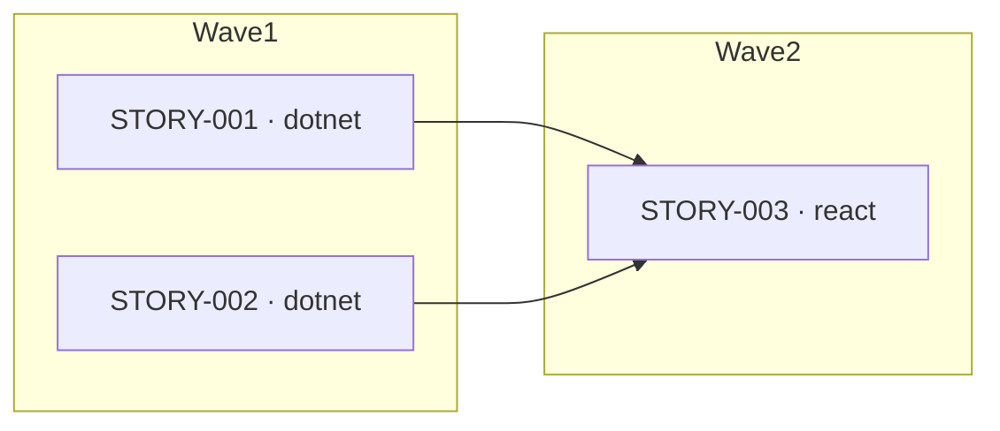

# Per-Story Files, Index, and Execution-Plan Diagram — Implementation Plan

> **For agentic workers:** REQUIRED SUB-SKILL: Use superpowers:subagent-driven-development (recommended) or superpowers:executing-plans to implement this plan task-by-task. Steps use checkbox (`- [ ]`) syntax for tracking.

**Goal:** Replace the monolithic `runs/<run-id>/stories.md` with a `stories/` directory containing one self-contained file per story plus an `index.md` that carries a machine-readable wave table and a Mermaid execution-plan diagram, and make that wave table drive the orchestrator's development ordering.

**Architecture:** This plugin is entirely markdown-prompt-driven — agents, skills, and commands are `.md` files; there is no compiled code and no test runner. "Tests" in this plan are therefore **verification greps/reads** that confirm a contract string is present (or a stale one is gone). The `write-stories` skill is the single source of truth for the two new file formats and the wave algorithm; the Tech Lead agent, the Tech Lead Validator, and the `advance-stage` orchestrator all consume that same contract, so their strings must match the skill exactly.

**Tech Stack:** Markdown prompt files under `plugins/agentic-sdlc/`. Mermaid (rendered by GitHub natively). Git for commits.

---

## Canonical contract (referenced by multiple tasks — defined once here)

**A. `index.md` format** (`runs/<run-id>/stories/index.md`):

````markdown
# Stories — Run <run-id>
Status: draft | approved
Version: <n>

## Execution plan


## Story index
| Story | Track | Wave | Depends on | Complexity | File |
|-------|-------|------|-----------|-----------|------|
| STORY-001 | dotnet | 1 | — | M | [STORY-001.md](STORY-001.md) |
| STORY-002 | dotnet | 1 | — | S | [STORY-002.md](STORY-002.md) |
| STORY-003 | react | 2 | STORY-001, STORY-002 | M | [STORY-003.md](STORY-003.md) |
````

**B. Per-story file format** (`runs/<run-id>/stories/STORY-XXX.md`):

```markdown
# STORY-001: <short name (3–6 words)>
Run ID: <run-id>
**Track:** dotnet | react
**Wave:** 1
**Implements:** [TECH-001, TECH-002]
**Depends on:** []
**Estimated complexity:** S | M | L
**Coverage threshold:** {"lines": 80, "critical_paths": 90}

## Description
<what to build — concrete, actionable, enough to work without asking questions>

## Acceptance criteria
- <specific, testable criterion>
- <second criterion>
```

**C. Wave algorithm:** `Depends on` is the single source of truth. Wave 1 = every
story with empty `Depends on`. Wave N = every story whose dependencies all sit in
waves `< N`. The diagram edges are exactly the union of all `Depends on` entries
(`dependency --> story`).

**D. Parse contract (orchestrator):** read the `## Story index` table. Fixed
columns in order: `Story | Track | Wave | Depends on | Complexity | File`.
`Depends on` is a comma-separated list of STORY-IDs, or `—`/`[]` when empty.

---

## Task 1: Rewrite the `write-stories` skill (contract source of truth)

**Files:**
- Modify: `plugins/agentic-sdlc/skills/write-stories/SKILL.md` (full body replace below the frontmatter)

- [ ] **Step 1: Replace the skill body**

Keep the frontmatter (`---` block) as-is. Replace everything from `# Writing Stories` to end of file with:

````markdown
# Writing Stories

The Tech Lead writes a `stories/` **directory**, not a single file:

```
runs/<run-id>/stories/
  index.md          ← overview, execution-plan diagram, story table
  STORY-001.md      ← one self-contained file per story
  STORY-002.md
```

## ID assignment rules
- IDs are STORY-001, STORY-002, ... in definition order.
- IDs are **write-once** — never renumber or reuse.
- When revising: only add new IDs at the end; never delete a story file.

## Track assignment
- `dotnet` track: backend API endpoints, services, data models, DB migrations.
- `react` track: UI components, pages, state management, API calls from the frontend.
- One story belongs to exactly one track. If a feature needs both frontend and
  backend, create two stories (one per track) with the react story listing the
  dotnet story in its `Depends on`.

## Traceability rules
- Every TECH-ID from the tech spec must be covered by at least one story.
- Each story's `Implements` field lists the TECH-IDs it delivers.

## Dependencies and waves
- `Depends on` is the **single source of truth** for ordering.
- A **wave** is a topological layer:
  - Wave 1 = every story whose `Depends on` is empty.
  - Wave N = every story whose dependencies all sit in waves `< N`.
- Compute each story's wave from `Depends on`, then write that wave into both the
  story file's `**Wave:**` field and the index table's `Wave` column.
- The dependency graph MUST be acyclic. A story MUST NOT depend on itself.

## Per-story file format (`STORY-XXX.md`)

```markdown
# STORY-001: <short name (3–6 words)>
Run ID: <run-id>
**Track:** dotnet | react
**Wave:** 1
**Implements:** [TECH-001, TECH-002]
**Depends on:** []
**Estimated complexity:** S | M | L
**Coverage threshold:** {"lines": 80, "critical_paths": 90}

## Description
<what to build — concrete, actionable, enough for an engineer to work without asking questions>

## Acceptance criteria
- <specific, testable criterion (e.g., "GET /api/todos returns 200 with JSON array")>
- <second criterion>
```

## Index format (`index.md`)

The orchestrator parses the `## Story index` table, so its columns are fixed and
in this exact order: `Story | Track | Wave | Depends on | Complexity | File`.
The Mermaid edges are exactly the union of all `Depends on` entries.

````markdown
# Stories — Run <run-id>
Status: draft | approved
Version: <n>

## Execution plan


## Story index
| Story | Track | Wave | Depends on | Complexity | File |
|-------|-------|------|-----------|-----------|------|
| STORY-001 | dotnet | 1 | — | M | [STORY-001.md](STORY-001.md) |
| STORY-002 | dotnet | 1 | — | S | [STORY-002.md](STORY-002.md) |
| STORY-003 | react | 2 | STORY-001, STORY-002 | M | [STORY-003.md](STORY-003.md) |
````

Use `—` in the `Depends on` column for stories with no dependencies.

## Complexity guidelines
- **S (Small):** Single endpoint or component, no new data model, < 1 hour.
- **M (Medium):** 2–5 endpoints or a full CRUD flow, 1–3 hours.
- **L (Large):** New subsystem, complex state, cross-cutting concern, > 3 hours.

## Quality checklist (self-check before finishing)
- [ ] Every TECH-ID from tech-spec.md appears in at least one story's Implements list
- [ ] Each story belongs to exactly one track (dotnet or react)
- [ ] Acceptance criteria are specific enough to write a failing test for
- [ ] `index.md` exists with the `## Execution plan` diagram and `## Story index` table
- [ ] Every story in the index table has a matching `STORY-XXX.md` file, and vice-versa
- [ ] Each story's `**Wave:**` field matches its `Wave` column in the index
- [ ] Waves are correct: wave 1 has empty `Depends on`; every dependency sits in an earlier wave
- [ ] Mermaid edges equal the union of all `Depends on` fields
- [ ] No dependency cycles; no story depends on itself
- [ ] `index.md` Status is "draft"
````

- [ ] **Step 2: Verify the new contract strings are present**

Run: `grep -nE "## Story index|## Execution plan|\*\*Wave:\*\*|Story \| Track \| Wave" plugins/agentic-sdlc/skills/write-stories/SKILL.md`
Expected: matches for the index headings, the Wave field, and the table header row.

- [ ] **Step 3: Verify the old monolithic format is gone**

Run: `grep -nE "## STORY-001: \.\.\.|Used by the Tech Lead agent" plugins/agentic-sdlc/skills/write-stories/SKILL.md`
Expected: no match for the old `## STORY-002: ...` continuation example (frontmatter description line may still say "Used by the Tech Lead agent" — that is fine).

- [ ] **Step 4: Commit**

```bash
git add plugins/agentic-sdlc/skills/write-stories/SKILL.md
git commit -m "feat(write-stories): per-story files + index with wave table and diagram"
```

---

## Task 2: Update the Tech Lead agent to produce the `stories/` directory

**Files:**
- Modify: `plugins/agentic-sdlc/agents/tech-lead.md`

- [ ] **Step 1: Update the frontmatter description**

Replace line 3:
```
description: Tech Lead. Converts the approved technical spec into implementation stories (stories.md). Invoke during the Tech Lead stage; same agent is re-invoked for revisions (driven by validator feedback or user revision notes — there is no separate revision stage).
```
with:
```
description: Tech Lead. Converts the approved technical spec into implementation stories (the runs/<run-id>/stories/ directory: index.md + one STORY-XXX.md per story). Invoke during the Tech Lead stage; same agent is re-invoked for revisions (driven by validator feedback or user revision notes — there is no separate revision stage).
```

- [ ] **Step 2: Update the "Your job" line**

Replace line 11:
```
Convert `tech-spec.md` into `stories.md` — independently deliverable stories per track, following the write-stories skill.
```
with:
```
Convert `tech-spec.md` into the `runs/<run-id>/stories/` directory — `index.md` plus one self-contained `STORY-XXX.md` per story, independently deliverable per track, following the write-stories skill.
```

- [ ] **Step 3: Update the Outputs section**

Replace line 19:
```
- `runs/<run-id>/stories.md`
```
with:
```
- `runs/<run-id>/stories/index.md` — overview, execution-plan diagram, story table
- `runs/<run-id>/stories/STORY-XXX.md` — one self-contained file per story
```

- [ ] **Step 4: Update the Process steps**

Replace the Process block (lines 21–30, from `## Process` through the `9.` line) with:
```
## Process
1. Read `runs/<run-id>/tech-spec.md` fully.
2. List all TECH-IDs and identify their track (dotnet or react).
3. Group related TECH-IDs into cohesive, independently deliverable stories.
4. For each story: assign track, list TECH-IDs, write clear testable acceptance criteria, set a coverage threshold.
5. Set dependencies: if a react story uses a dotnet API, add the dotnet story to `Depends on`.
6. Compute each story's wave from `Depends on` (per the write-stories skill) and write it into both the story file and the index table.
7. Estimate complexity per the write-stories skill guidelines.
8. Write one `runs/<run-id>/stories/STORY-XXX.md` per story.
9. Write `runs/<run-id>/stories/index.md` with the `## Execution plan` Mermaid diagram and the `## Story index` table (Mermaid edges = union of all `Depends on`).
10. Self-check: every TECH-ID appears in at least one story's Implements list; index rows ↔ story files in sync; waves correct; no cycles.
11. If revising: increment Version in `index.md`; do not change existing STORY IDs or delete story files.
```

- [ ] **Step 5: Update the Definition of done**

Replace line 37:
```
- `stories.md` saved with Status: draft.
```
with:
```
- `runs/<run-id>/stories/index.md` saved with Status: draft, plus one STORY-XXX.md per row in its table.
```

- [ ] **Step 6: Update the Spec-freeze guardrail**

Replace line 43:
```
After Tech Lead approval (your own user-review gate), all three artifacts are frozen. If you are invoked while `state.spec_frozen = true`, refuse and tell the orchestrator the spec is frozen — do not edit any artifact.
```
with:
```
After Tech Lead approval (your own user-review gate), all upstream artifacts are frozen — `req-spec.md`, `tech-spec.md`, and every file under `runs/<run-id>/stories/`. If you are invoked while `state.spec_frozen = true`, refuse and tell the orchestrator the spec is frozen — do not edit any artifact.
```

- [ ] **Step 7: Verify no `stories.md` references remain**

Run: `grep -n "stories\.md" plugins/agentic-sdlc/agents/tech-lead.md`
Expected: no matches.

- [ ] **Step 8: Commit**

```bash
git add plugins/agentic-sdlc/agents/tech-lead.md
git commit -m "feat(tech-lead): write stories/ directory instead of stories.md"
```

---

## Task 3: Extend the Tech Lead Validator

**Files:**
- Modify: `plugins/agentic-sdlc/agents/tech-lead-validator.md`

The cycle / self-reference / forward-reference checks already exist (steps 9–12).
Add index↔files-sync and wave-correctness checks, and update the paths.

- [ ] **Step 1: Update the frontmatter description**

Replace line 3:
```
description: Tech Lead Validator. Validates stories.md against tech-spec.md for coverage and correctness. Invoke after the Tech Lead produces stories.md.
```
with:
```
description: Tech Lead Validator. Validates the runs/<run-id>/stories/ directory (index.md + STORY-XXX.md files) against tech-spec.md for coverage, structure, and execution-plan correctness. Invoke after the Tech Lead produces the stories directory.
```

- [ ] **Step 2: Update the "Your job" line**

Replace line 11:
```
Verify that `stories.md` correctly implements all of `tech-spec.md` using the validate-traceability skill.
```
with:
```
Verify that the `runs/<run-id>/stories/` directory correctly implements all of `tech-spec.md` using the validate-traceability skill, and that its index, per-story files, waves, and diagram are mutually consistent.
```

- [ ] **Step 3: Update the Inputs section**

Replace line 16:
```
- `runs/<run-id>/stories.md`
```
with:
```
- `runs/<run-id>/stories/index.md`
- `runs/<run-id>/stories/STORY-XXX.md` (all story files)
```

- [ ] **Step 4: Insert structure and wave checks**

After the existing step 12 line (`12. Status: "pass" ...`), but BEFORE it — i.e. renumber so Status stays last. Concretely, replace step 12:
```
12. Status: "pass" if missing and added_without_source are empty.
```
with:
```
12. **Index↔files sync:** every row in `index.md`'s `## Story index` table must have a matching `STORY-XXX.md` file, and every `STORY-XXX.md` file must appear as a row. Mismatch → `added_without_source` with `description: "Index/file mismatch: STORY-XXX"`.
13. **Wave correctness:** for each story, recompute its wave from `Depends on` (wave 1 = empty deps; wave N = all deps in earlier waves). The recomputed wave must equal both the `**Wave:**` field in the story file and the `Wave` column in the index. Mismatch → `altered` with a note naming the story and the expected wave.
14. **Diagram consistency:** the Mermaid edges in `## Execution plan` must equal the union of all `Depends on` entries (one `dependency --> story` edge per dependency). Missing or extra edges → `altered` with a note.
15. Status: "pass" if `missing` and `added_without_source` are empty.
```

- [ ] **Step 5: Update the forward-reference path mention**

Replace line 32 (`11. **Forward-reference check:** ... in stories.md.`):
```
11. **Forward-reference check:** every entry in `Depends on` must be a defined STORY-ID in stories.md. Unknown IDs → `added_without_source`.
```
with:
```
11. **Forward-reference check:** every entry in `Depends on` must be a defined STORY-ID present as a `STORY-XXX.md` file. Unknown IDs → `added_without_source`.
```

- [ ] **Step 6: Verify checks and paths**

Run: `grep -nE "Index↔files sync|Wave correctness|Diagram consistency|stories/index.md" plugins/agentic-sdlc/agents/tech-lead-validator.md`
Expected: matches for all three new checks and the index path.

Run: `grep -n "stories\.md" plugins/agentic-sdlc/agents/tech-lead-validator.md`
Expected: no matches.

- [ ] **Step 7: Commit**

```bash
git add plugins/agentic-sdlc/agents/tech-lead-validator.md
git commit -m "feat(tech-lead-validator): validate index/files sync, waves, and diagram"
```

---

## Task 4: Update the orchestrator (`advance-stage`)

**Files:**
- Modify: `plugins/agentic-sdlc/commands/advance-stage.md`

- [ ] **Step 1: Widen the spec-freeze check to the stories directory**

Replace line 37:
```
Before invoking any agent: if `spec_frozen = true` and the current stage would modify req-spec.md, tech-spec.md, or stories.md — do NOT proceed. Say: "The spec is frozen. To make upstream changes, use /agentic-sdlc:cancel-run and start a new run."
```
with:
```
Before invoking any agent: if `spec_frozen = true` and the current stage would modify req-spec.md, tech-spec.md, or any file under `runs/<run-id>/stories/` — do NOT proceed. Say: "The spec is frozen. To make upstream changes, use /agentic-sdlc:cancel-run and start a new run."
```

- [ ] **Step 2: Update the Tech Lead commit paths**

Replace line 101:
```
   git add runs/<run-id>/stories.md runs/<run-id>/state.json
```
with:
```
   git add runs/<run-id>/stories/ runs/<run-id>/state.json
```

- [ ] **Step 3: Update the validator invocation inputs**

Replace line 108:
```
c. Invoke `tech-lead-validator`. Pass: run-id, paths to tech-spec.md and stories.md.
```
with:
```
c. Invoke `tech-lead-validator`. Pass: run-id, path to tech-spec.md and the runs/<run-id>/stories/ directory (index.md + all STORY-XXX.md files).
```

- [ ] **Step 4: Update the stories review-gate display**

Replace line 126:
```
Display `runs/<run-id>/stories.md`.
```
with:
```
Display `runs/<run-id>/stories/index.md` (the execution-plan diagram and story table). Offer to show any individual `STORY-XXX.md` on request.
```

- [ ] **Step 5: Update the spec-freeze parse to read the index table**

Replace line 132:
```
  3. Parse stories.md: for each `## STORY-XXX: ` heading, extract story ID and its `**Track:**` field. Add to `state.stories`:
```
with:
```
  3. Parse `runs/<run-id>/stories/index.md`: read the `## Story index` table (columns `Story | Track | Wave | Depends on | Complexity | File`). For each row, add to `state.stories` (capturing `track` and `wave`):
```

- [ ] **Step 6: Add `wave` to the story-state schema example**

Replace the JSON block at lines 133–135 (the `"STORY-001": { "track": "dotnet", ... }` example directly under step 3):
```json
     "STORY-001": { "track": "dotnet", "status": "pending", "reviewer_iterations": 0, "test_reviewer_iterations": 0, "fix_iterations": 0 }
```
with:
```json
     "STORY-001": { "track": "dotnet", "wave": 1, "status": "pending", "reviewer_iterations": 0, "test_reviewer_iterations": 0, "fix_iterations": 0 }
```

- [ ] **Step 7: Update the development ordering rule**

Replace line 163:
```
Process stories in dependency order (stories with empty `Depends on` first). Use state.stories to track which are complete.
```
with:
```
Process stories by **wave**: handle wave 1 first, then wave 2, and so on (read `wave` from `state.stories`). Within a wave, process in story-ID order. This honours the dependency graph computed by the Tech Lead. Use state.stories to track which are complete.
```

- [ ] **Step 8: Update the per-story content source**

Replace line 166:
```
1. Read the story content from stories.md.
```
with:
```
1. Read the story content from `runs/<run-id>/stories/STORY-XXX.md` (self-contained).
```

- [ ] **Step 9: Verify all changes**

Run: `grep -nE "stories/ runs|## Story index|by \*\*wave\*\*|stories/STORY-XXX.md|\"wave\": 1" plugins/agentic-sdlc/commands/advance-stage.md`
Expected: matches for the commit path, the index-table parse, the wave ordering, the per-story read, and the schema wave field.

Run: `grep -n "stories\.md" plugins/agentic-sdlc/commands/advance-stage.md`
Expected: no matches.

- [ ] **Step 10: Commit**

```bash
git add plugins/agentic-sdlc/commands/advance-stage.md
git commit -m "feat(advance-stage): parse stories index, drive dev order by wave"
```

---

## Task 5: Update `show-run-status`

**Files:**
- Modify: `plugins/agentic-sdlc/commands/show-run-status.md`

- [ ] **Step 1: Update the artifact existence/version check**

Replace line 17:
```
4. For each artifact (req-spec.md, tech-spec.md, stories.md), check if it exists. If it does, read its `Version:` line. **If the file exists but has no `Version:` line (mid-write or malformed), report version as `?`.**
```
with:
```
4. For each artifact (req-spec.md, tech-spec.md, stories/index.md), check if it exists. If it does, read its `Version:` line. **If the file exists but has no `Version:` line (mid-write or malformed), report version as `?`.**
```

- [ ] **Step 2: Update the artifacts display line**

Replace line 59:
```
  runs/<run-id>/stories.md      exists (v<n>) | missing
```
with:
```
  runs/<run-id>/stories/index.md  exists (v<n>) | missing
```

- [ ] **Step 3: Verify**

Run: `grep -n "stories/index.md" plugins/agentic-sdlc/commands/show-run-status.md`
Expected: two matches (the check and the display line).

Run: `grep -n "stories\.md" plugins/agentic-sdlc/commands/show-run-status.md`
Expected: no matches.

- [ ] **Step 4: Commit**

```bash
git add plugins/agentic-sdlc/commands/show-run-status.md
git commit -m "chore(show-run-status): point at stories/index.md"
```

---

## Task 6: Update the README

**Files:**
- Modify: `plugins/agentic-sdlc/README.md`

- [ ] **Step 1: Update the Tech Lead node in the Mermaid diagram**

Replace line 52:
```
        TL["🤖 Tech Lead<br/>writes stories.md"] --> TLV["🔍 Tech Lead Validator"]
```
with:
```
        TL["🤖 Tech Lead<br/>writes stories/ (index + per-story)"] --> TLV["🔍 Tech Lead Validator"]
```

- [ ] **Step 2: Update the stories review-gate node**

Replace line 58:
```
    TLV -- pass --> RG3{{"👤 User Review Gate<br/>stories.md"}}
```
with:
```
    TLV -- pass --> RG3{{"👤 User Review Gate<br/>stories/index.md"}}
```

- [ ] **Step 3: Update the spec-freeze rule text**

Replace line 156:
```
After you approve the stories, `req-spec.md`, `tech-spec.md`, and `stories.md` are **frozen**. No agent can modify them. To make upstream changes: `/agentic-sdlc:cancel-run` and start a new run.
```
with:
```
After you approve the stories, `req-spec.md`, `tech-spec.md`, and everything under `runs/<run-id>/stories/` are **frozen**. No agent can modify them. To make upstream changes: `/agentic-sdlc:cancel-run` and start a new run.
```

- [ ] **Step 4: Update the artifact tree**

Replace line 170:
```
│       └── stories.md                  ← Tech Lead output
```
with:
```
│       └── stories/                    ← Tech Lead output
│           ├── index.md                ← overview, execution-plan diagram, story table
│           ├── STORY-001.md            ← one self-contained file per story
│           └── STORY-002.md
```

- [ ] **Step 5: Verify**

Run: `grep -n "stories\.md" plugins/agentic-sdlc/README.md`
Expected: no matches.

Run: `grep -nE "stories/ \(index|stories/index.md|stories/ +← Tech Lead" plugins/agentic-sdlc/README.md`
Expected: matches for the diagram node, the gate node, and the tree.

- [ ] **Step 6: Commit**

```bash
git add plugins/agentic-sdlc/README.md
git commit -m "docs(readme): reflect stories/ directory layout"
```

---

## Task 7: Update engineer/test/devops freeze guardrails

**Files:**
- Modify: `plugins/agentic-sdlc/agents/dotnet-engineer.md:56`
- Modify: `plugins/agentic-sdlc/agents/react-engineer.md:198`
- Modify: `plugins/agentic-sdlc/agents/dotnet-test-engineer.md:85`
- Modify: `plugins/agentic-sdlc/agents/react-test-engineer.md:71`
- Modify: `plugins/agentic-sdlc/agents/devops-engineer.md:65`

Each file has a sentence of the form: `... NEVER modify ... or runs/<run-id>/stories.md. Those artifacts are frozen ...`. In each, replace the substring:
```
runs/<run-id>/stories.md
```
with:
```
any file under runs/<run-id>/stories/
```
Leave the rest of each sentence (including its trailing "Those artifacts are frozen ..." wording) unchanged.

- [ ] **Step 1: Edit `dotnet-engineer.md`** — apply the substring replacement on line 56.
- [ ] **Step 2: Edit `react-engineer.md`** — apply the substring replacement on line 198.
- [ ] **Step 3: Edit `dotnet-test-engineer.md`** — apply the substring replacement on line 85.
- [ ] **Step 4: Edit `react-test-engineer.md`** — apply the substring replacement on line 71.
- [ ] **Step 5: Edit `devops-engineer.md`** — apply the substring replacement on line 65.

- [ ] **Step 6: Verify all five updated and none stale**

Run: `grep -rn "stories\.md" plugins/agentic-sdlc/agents/`
Expected: no matches.

Run: `grep -rcn "any file under runs/<run-id>/stories/" plugins/agentic-sdlc/agents/dotnet-engineer.md plugins/agentic-sdlc/agents/react-engineer.md plugins/agentic-sdlc/agents/dotnet-test-engineer.md plugins/agentic-sdlc/agents/react-test-engineer.md plugins/agentic-sdlc/agents/devops-engineer.md`
Expected: each file reports 1.

- [ ] **Step 7: Commit**

```bash
git add plugins/agentic-sdlc/agents/dotnet-engineer.md plugins/agentic-sdlc/agents/react-engineer.md plugins/agentic-sdlc/agents/dotnet-test-engineer.md plugins/agentic-sdlc/agents/react-test-engineer.md plugins/agentic-sdlc/agents/devops-engineer.md
git commit -m "chore(agents): widen freeze guardrail to stories/ directory"
```

---

## Task 8: Final repo-wide verification

**Files:** none (verification only)

- [ ] **Step 1: Confirm no stale `stories.md` references remain anywhere in the plugin**

Run: `grep -rn "stories\.md" plugins/agentic-sdlc/ --include=*.md`
Expected: no matches. (If any appear, fix them in their file and amend that file's commit.)

- [ ] **Step 2: Confirm the parse contract column header is identical in skill and orchestrator**

Run: `grep -rn "Story | Track | Wave | Depends on | Complexity | File" plugins/agentic-sdlc/skills/write-stories/SKILL.md plugins/agentic-sdlc/commands/advance-stage.md`
Expected: the exact column list appears in both files (skill table header and orchestrator parse note).

- [ ] **Step 3: Confirm the design doc's six component changes are all covered**

Read `docs/superpowers/specs/2026-06-12-per-story-files-design.md` "Component changes" section and confirm each bullet maps to a completed task above (Tech Lead → Task 2, write-stories → Task 1, validator → Task 3, advance-stage → Task 4, show-run-status → Task 5, README → Task 6, engineer guardrails → Task 7).

- [ ] **Step 4: Final commit (if any verification fixes were needed)**

```bash
git add -A plugins/agentic-sdlc/
git commit -m "chore: per-story-files verification fixes" || echo "nothing to commit"
```

---

## Self-review notes (author)

- **Spec coverage:** design "Component changes" (6 bullets) → Tasks 1–7; "State.json impact" (wave field) → Task 4 Step 6; "Data flow" wave ordering → Task 4 Step 7; "Edge cases" cycles → Task 3 (existing checks retained). `start-run.md` had no `stories.md` reference (verified by grep) so it is intentionally not a task.
- **No placeholders:** every edit shows the exact before/after string.
- **Type/string consistency:** the column header `Story | Track | Wave | Depends on | Complexity | File`, the `**Wave:**` field, the `## Story index` / `## Execution plan` headings, and the `runs/<run-id>/stories/` path are used identically across Tasks 1, 3, and 4.
