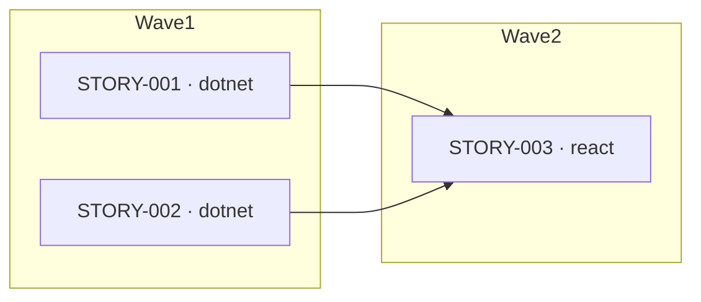

# Per-Story Files, Index, and Execution-Plan Diagram — Design

Date: 2026-06-12
Status: Approved (sequential execution; parallel dispatch out of scope)

## Problem

The Tech Lead produces a single monolithic `runs/<run-id>/stories.md`. The
orchestrator parses it by grepping `## STORY-XXX:` headings and `**Track:**`
fields, and dispatches development by a vague rule ("stories with empty
`Depends on` first"). This has three weaknesses:

1. **No real execution plan.** Dependency ordering is underspecified — the
   orchestrator has no topological algorithm and no cycle detection, so a
   cross-track story (e.g. a react story depending on a dotnet story) can be
   dispatched before its dependency.
2. **Coarse artifact.** Engineers receive story content sliced out of a large
   file; there is no self-contained per-story unit.
3. **No visualization.** There is no diagram of how stories relate or in what
   order they run.

## Goals

- One self-contained file per story.
- An `index.md` that replaces `stories.md`, carrying an overview, a
  machine-readable story table, and a Mermaid execution-plan diagram.
- The execution plan **drives** the orchestrator's story ordering (replacing the
  vague rule and fixing the dependency-ordering gap), and is validated.

## Non-goals (YAGNI)

- **Parallel dispatch.** Waves make parallel-eligible stories visible, but
  execution stays sequential (wave order, story-ID order within a wave). Actual
  concurrent dispatch via worktrees/subagents is a possible later follow-up.
- **Viewer.** No changes to `plugins/agentic-sdlc/viewer/` (it is unbuilt
  scaffolding). Diagrams render via GitHub's native Mermaid support.

## Artifact layout

`runs/<run-id>/stories.md` is replaced by a directory:

```
runs/<run-id>/stories/
  index.md          ← overview, execution-plan diagram, machine-readable wave table
  STORY-001.md      ← one self-contained file per story
  STORY-002.md
  STORY-003.md
```

## `index.md` format

The orchestrator parses this file. It carries a machine-readable table **and** a
rendered diagram, both derived from the same `Depends on` data so they cannot
drift.

````markdown
# Stories — Run <run-id>
Status: draft | approved
Version: <n>

## Execution plan


## Story index
| Story | Track | Wave | Depends on | Complexity | File |
|-------|-------|------|-----------|-----------|------|
| STORY-001 | dotnet | 1 | — | M | [STORY-001.md](STORY-001.md) |
| STORY-002 | dotnet | 1 | — | S | [STORY-002.md](STORY-002.md) |
| STORY-003 | react | 2 | STORY-001, STORY-002 | M | [STORY-003.md](STORY-003.md) |
````

**Wave definition (topological layering):** wave 1 is every story whose
`Depends on` is empty; wave N is every story whose dependencies all sit in waves
`< N`. The orchestrator processes waves in ascending order; within a wave, in
story-ID order.

**Parse contract:** the orchestrator reads the `## Story index` table. Columns
are fixed: `Story | Track | Wave | Depends on | Complexity | File`. `Depends on`
is a comma-separated list of story IDs or `—`/`[]` for none.

## Per-story file format

Each `STORY-XXX.md` is self-contained, so the orchestrator passes exactly that
one file to the engineer.

```markdown
# STORY-001: <short name (3–6 words)>
Run ID: <run-id>
**Track:** dotnet | react
**Wave:** 1
**Implements:** [TECH-001, TECH-002]
**Depends on:** []
**Estimated complexity:** S | M | L
**Coverage threshold:** {"lines": 80, "critical_paths": 90}

## Description
<what to build — concrete, actionable, enough to work without asking questions>

## Acceptance criteria
- <specific, testable criterion>
- <second criterion>
```

`Depends on` is the single source of truth. `Wave` (in both the per-story file
and the index table) and the diagram edges are derived from it.

## Component changes

### Tech Lead agent (`agents/tech-lead.md`) + `write-stories` skill
- Write the `stories/` directory instead of `stories.md`.
- `write-stories/SKILL.md` is rewritten for the two file formats above and gains
  a rule for computing waves from `Depends on` (topological layering) and
  rendering the Mermaid diagram from the dependency edges.
- Self-check additions: index rows ↔ story files in sync; waves correct; diagram
  edges equal the union of `Depends on`; no cycles.

### Tech Lead Validator (`agents/tech-lead-validator.md`)
Extended to assert, in addition to today's coverage/traceability checks:
- every `index.md` row has a matching `STORY-XXX.md` file, and vice-versa;
- each story's `Wave` is correct given its `Depends on` (proper topological
  layering);
- the Mermaid edges equal the union of all `Depends on` fields;
- no dependency cycles;
- every TECH-ID from `tech-spec.md` is covered by at least one story.

### Orchestrator (`commands/advance-stage.md`)
- **Spec-freeze gate parse:** read the `## Story index` table from `index.md`
  (not `## STORY-XXX` greps). Populate `state.stories` from the table, adding a
  `wave` field per story.
- **Development ordering:** "process waves in ascending order; within a wave,
  story-ID order." Replaces the "empty Depends-on first" rule.
- **Engineer input:** pass `runs/<run-id>/stories/STORY-XXX.md` directly.
- **Spec-freeze scope:** the freeze check and the agent guardrail text change
  from "stories.md" to "any file under `runs/<run-id>/stories/`".

### Other touch-ups
- `commands/start-run.md`: any reference to `stories.md` → `stories/`.
- `commands/show-run-status.md`: artifact existence/version check reads
  `runs/<run-id>/stories/index.md`; story list still comes from `state.stories`.
- `README.md`: pipeline diagram and "Where artifacts live" tree updated.
- `commands/cancel-run.md`: unaffected (deletes the whole `runs/<run-id>/`).

## State.json impact

`state.stories[STORY-XXX]` gains a `wave` integer (populated at the spec-freeze
parse). No other schema change. Existing counters
(`reviewer_iterations`, `test_reviewer_iterations`, `fix_iterations`) unchanged.

## Data flow

```
Tech Lead → stories/index.md + STORY-*.md
         → Tech Lead Validator (index↔files, waves, edges, cycles, coverage)
         → user review gate → SPEC FREEZE
         → orchestrator parses index table → state.stories (with wave)
         → development: for wave in ascending order:
              for story in wave (ID order):
                 pass STORY-XXX.md to engineer → review → test → done
```

## Edge cases

- **Cycle in dependencies:** caught by the validator → fail → Tech Lead revises.
  The orchestrator never sees a cyclic plan past the freeze gate.
- **Story file present but missing from index (or vice-versa):** caught by the
  validator.
- **Single story / no dependencies:** all stories land in wave 1; behavior
  matches today's flat dispatch.
- **Mid-development resume:** unchanged from today — `state.stories` status still
  drives which stories remain (this design does not alter the `in_progress`
  resume gap noted in the workflow review; that is a separate fix).

## Backward compatibility

No migration of in-flight runs. Runs started before this change keep their
`stories.md`; the change applies to new runs. (Optional: orchestrator may detect
a legacy `stories.md` and fall back to the old parse — decided at planning time.)
