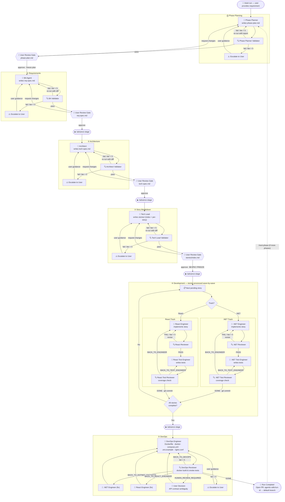
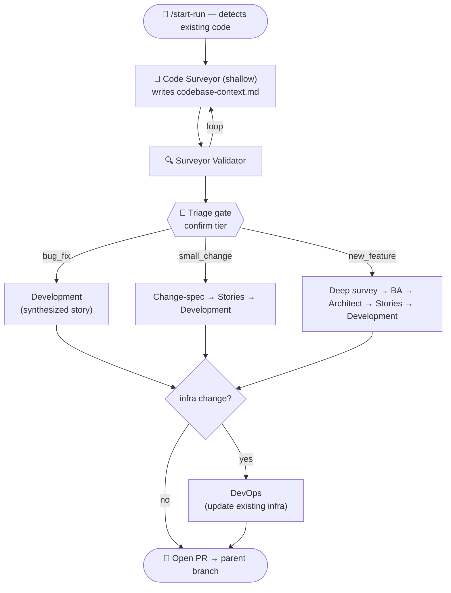

# Agentic SDLC Plugin

A multi-agent SDLC pipeline for Claude Code. Takes a plain-language requirement and produces a runnable .NET + React application through a pipeline of specialized AI agents.

## What it does

Each stage of the SDLC is handled by a specialized AI agent with a paired validator that loops until the output is correct (up to 5 iterations) before any human review.

| Stage | Agent | Validator |
|---|---|---|
| Phase planning | Phase Planner | Phase Planner Validator |
| Codebase survey (brownfield) | Code Surveyor | Code Surveyor Validator |
| Requirements | Business Analyst | BA Validator |
| Architecture | Architect | Architect Validator |
| Story breakdown | Tech Lead | Tech Lead Validator |
| .NET backend | .NET Engineer + Reviewer | .NET Test Engineer + Reviewer |
| React frontend | React Engineer + Reviewer | React Test Engineer + Reviewer |
| Containerization | DevOps Engineer | DevOps Reviewer |

## Workflow diagram



## Core principles

1. **Requirement spec is the source of truth.** Every artifact traces back to it.
2. **Creator + Validator pattern.** Every agent that produces an artifact has a paired validator.
3. **Spec freeze at story dispatch.** Once development begins, upstream specs are immutable.
4. **Single-language tracks.** Web runs develop `.NET` and `React` in parallel (logically); electron runs use one `electron` track.
5. **Runnable definition of done.** Complete only when `docker compose up` produces a working app.

## Application archetypes

A run targets one **application archetype**, recorded as `app_type` in `state.json`:

| `app_type` | Stack | Development tracks | Definition of done |
|---|---|---|---|
| `web` (default) | .NET 8 API + React 18 + PostgreSQL | `dotnet`, `react` | `docker compose up` serves a working app (DevOps stage) |
| `electron` | Electron + TypeScript pnpm monorepo (electron-vite, node-pty, xterm) | `electron` (main/preload/renderer) | electron-builder packages the app and it smoke-launches (Packager stage) |

Greenfield runs pick the archetype at `/start-run`; brownfield runs auto-detect it
(the Code Surveyor flags `electron` when it sees `electron` in `package.json`, a
`pnpm-workspace.yaml`, or an `electron.vite.config.*`). Electron runs replace the
DevOps/containerization stage with a **Packager** stage
(`electron-packager` → `electron-packager-reviewer`) and follow the
`agentic-sdlc:electron-conventions` skill's secure-by-default rules (contextIsolation +
sandbox on, nodeIntegration off, zod-validated IPC).

## Brownfield mode

When `/start-run` detects an existing codebase (a `.csproj`/`.sln` or `package.json`
in the source paths), it switches from the greenfield program/phase flow to a
right-sized **brownfield change run** (`runs/change-YYYY-MM-DD-NNN/`, branch
`agentic-sdlc/change-YYYY-MM-DD-NNN`). A **Code Surveyor** agent first writes a shared
`codebase-context.md` (stack, conventions, architecture, impact map, test baseline,
infra assessment) and proposes a **tier** at a triage gate. The tier picks a
right-sized pipeline:

| Tier | Stages | Gates |
|---|---|---|
| **bug-fix** | survey(shallow) → development (TDD; a failing test reproduces the bug first) → devops? | 1 (triage) |
| **small-change** | survey(med) → change-spec (BA-lite) → stories → development → devops? | 3 (triage, change-spec, stories) |
| **new-feature** | survey(deep) → BA → Architect → stories → development → devops? | 4 (triage, req, tech, stories) |

DevOps runs only when the change needs infra changes (new service, env var, port,
dependency). The brownfield done-gate keeps the repo's **full existing test suite**
green — no new failures versus the surveyor's baseline — plus new tests covering the
change. Pre-existing failures are surfaced, never hidden.

A **new-feature** that spans several features can be **split** at the triage gate
into a brownfield *program*: it runs the Phase Planner loop and ships one PR per
phase via `/agentic-sdlc:next-phase`, with every phase brownfield-aware (reads
`codebase-context.md`, works the delta, conditional DevOps).



## Install

```
/plugin marketplace add ecogs-sys/Agentic.SDLC
/plugin install agentic-sdlc@agentic-sdlc-marketplace
```

## Quick start

```
/agentic-sdlc:start-run
```

Paste your requirement when prompted. Then:

```
/agentic-sdlc:advance-stage
```

Repeat `/advance-stage` after each approval. You'll be asked to review and approve at four gates (phase plan, requirement spec, technical spec, stories).

## Pipeline order

```
/start-run          → Phase Planner → Validator (loop) → [user review phase plan]
                    → freeze plan → create Phase 1 run → detect src paths
                    → git branch agentic-sdlc/<program-id>/phase-01
                    → BA → BA Validator (loop) → [user review req spec]
/advance-stage      → Architect → Architect Validator (loop) → [user review tech spec]
/advance-stage      → Tech Lead → Tech Lead Validator (loop) → [user review stories]
                    ══ SPEC FREEZE ══
/advance-stage      → .NET stories (Engineer → Reviewer → Test Engineer → Test Reviewer → git commit)
                    → React stories (Engineer → Reviewer → Test Engineer → Test Reviewer → git commit)
/advance-stage      → DevOps Engineer → DevOps Reviewer → git commit → open PR

# Brownfield (existing code detected at /start-run):
/start-run  → Code Surveyor (shallow) → [triage gate · confirm tier]
            → bug_fix      → development → [devops if infra change] → PR
            → small_change → change-spec → stories → development → [devops?] → PR
            → new_feature  → Surveyor (deep) → BA → Architect → stories
                           → development → [devops?] → PR
```

## Spec freeze rule

After you approve the stories, `req-spec.md`, `tech-spec.md`, and everything under `runs/<run-id>/stories/` are **frozen**. No agent can modify them. To make upstream changes: `/agentic-sdlc:cancel-run` and start a new run.

## Phases

A large requirement is split by the Phase Planner into ordered, independently
shippable phases. Each phase is its own run under `runs/<program-id>/phase-0N/`,
ships on its own branch `agentic-sdlc/<program-id>/phase-0N`, and opens its own PR.
Phases are strictly sequential: after a phase's PR is merged, run
`/agentic-sdlc:next-phase` to start the next one (which branches from the updated
default branch and builds on the shipped code). A small requirement yields a
single-phase plan and behaves like one ordinary run.

## Where artifacts live

Each run operates on its own git branch (`agentic-sdlc/<run-id>`). SDLC artifacts stay in `runs/`, generated code goes into your source tree.

```
<your-workspace>/                       ← workspace root (git repo)
├── runs/
│   └── program-YYYY-MM-DD-001/         ← one big requirement
│       ├── program.json                ← program state machine (phases, current_phase)
│       ├── original-input.md           ← full requirement, verbatim
│       ├── phase-plan.md               ← Phase Planner output (frozen)
│       └── phase-01/                   ← a full run, scoped to Phase 1
│           ├── state.json              ← per-phase state machine
│           ├── progress.log            ← append-only activity feed (tail -f it during long stages)
│           ├── raw-input.md            ← this phase's scope
│           ├── req-spec.md             ← BA output
│           ├── tech-spec.md            ← Architect output
│           └── stories/                ← Tech Lead output (index.md + STORY-N.md)
│
├── src/backend/                        ← generated .NET source (default)
│   ├── AppName.sln
│   ├── AppName.Domain/
│   ├── AppName.Application/
│   ├── AppName.Infrastructure/
│   └── AppName.Api/
├── tests/backend/                      ← generated .NET tests (default — never under src/)
│   └── AppName.Tests/
├── src/frontend/                       ← generated React project (default)
│   └── src/                            ← React tests are co-located (*.test.tsx)
│
├── docker-compose.yml                  ← DevOps output (workspace root)
├── .env.example
└── README.md
```

Source paths are detected from your existing repo layout at `/start-run` time and stored in `state.json`. If you already have a `backend/` and `frontend/` at the root, or a different `src/` layout, the plugin uses those paths instead.

At the end of each phase, open a PR from `agentic-sdlc/<run-id>` → your default branch (the branch you started the run from, recorded as `parent_branch`) to ship the generated code through your normal review process.

### Brownfield change run (existing repo → bug-fix / small-change / single new-feature)

A standalone run — no program/phase nesting. Code is edited in place in your existing
source tree; infra files change only when the Architect's `Infra change` line is `required`.

```
<your-workspace>/
├── runs/
│   └── change-YYYY-MM-DD-001/           ← one change run
│       ├── state.json                   ← mode:brownfield · tier · pipeline · test_baseline · infra_change_required
│       ├── raw-input.md                 ← your change request, verbatim
│       ├── codebase-context.md          ← Code Surveyor (stack, conventions, impact map, baseline)
│       ├── change-spec.md               ← small-change tier only (BA-lite)
│       ├── req-spec.md  tech-spec.md    ← new-feature tier only
│       └── stories/                     ← index.md + STORY-N.md (bug-fix: one synthesized story)
│
└── (your existing src tree — edited in place)
```

Which artifacts appear depends on tier:

| Tier | codebase-context.md | change-spec.md | req-spec / tech-spec | stories/ |
|---|---|---|---|---|
| bug-fix | shallow | — | — | synthesized |
| small-change | shallow | ✅ | — | ✅ |
| new-feature (single) | deep | — | ✅ | ✅ |

Branch `agentic-sdlc/change-YYYY-MM-DD-001` → one PR.

### Brownfield program (existing repo → new-feature split into several features)

Reuses the program/phase machinery, brownfield-flagged. The Code Surveyor runs once at
the program level (shared `codebase-context.md`); each phase ships its own branch + PR
via `/agentic-sdlc:next-phase`.

```
<your-workspace>/
└── runs/
    └── program-YYYY-MM-DD-002/
        ├── program.json                 ← mode:brownfield · codebase_context_path · infra_change_required · test_baseline
        ├── original-input.md            ← the change request
        ├── codebase-context.md          ← program-level survey (shared by all phases)
        ├── phase-plan.md                ← Phase Planner (features added to the existing system)
        ├── phase-01/                    ← mode:brownfield (no survey/triage stage)
        │   ├── state.json  raw-input.md  req-spec.md  tech-spec.md
        │   └── stories/
        └── phase-02/ …                  ← created by /next-phase, its own branch + PR
```

## Other commands

| Command | Purpose |
|---|---|
| `/agentic-sdlc:show-run-status` | Show current stage, artifact status, and recent activity |
| `/agentic-sdlc:cancel-run` | Cancel and clean up the current run |
| `/agentic-sdlc:next-phase` | Start the next phase once the current one is merged |

## Watching progress

- The orchestrator prints a one-line banner before/after every agent it runs
  (`▶ [development 4/7] STORY-003 (3/6, wave 2) — dotnet-engineer (iter 2/5)`), a
  short summary when each stage begins, and an explicit ⛔ escalation block whenever
  a loop hits its 5-iteration cap.
- Every state change and commit is appended to `runs/<run-id>/progress.log` — you
  can `tail -f` it from another terminal during long stages, and
  `/agentic-sdlc:show-run-status` shows the last 10 events.
- **Optional statusline:** always-visible run state in the Claude Code statusline
  (zero token cost). Add to your workspace `.claude/settings.json`:
  ```json
  { "statusLine": { "type": "command",
      "command": "node <path-to-plugin>/scripts/statusline-sdlc.mjs" } }
  ```
  It renders e.g. `SDLC ▸ program-…/phase-01 ▸ development ▸ STORY-003 ▸ last: reviewer PASS`
  and prints nothing when no run is active.

## Troubleshooting

**Coverage threshold failures:** The test reviewer sends the test engineer back to add more tests. After 5 iterations, you're prompted for guidance.

**DevOps build failures:** The DevOps reviewer routes back to the correct agent. Docker config issues go to the DevOps Engineer; code bugs go to the relevant track's Engineer.

**Spec ambiguity:** If the DevOps reviewer finds an API contract mismatch, it escalates to you rather than auto-routing.
