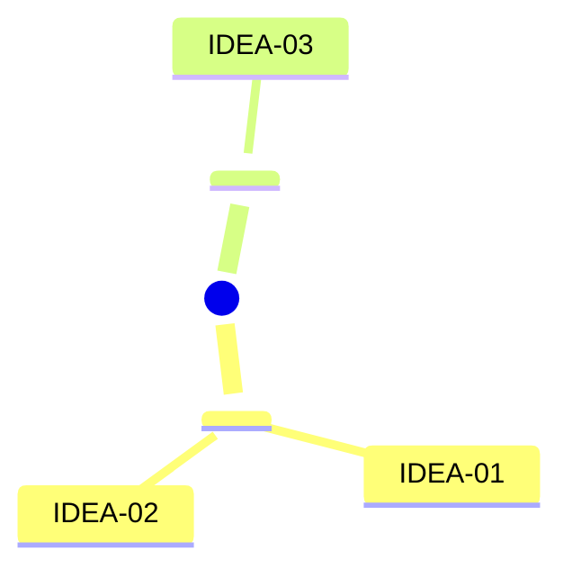
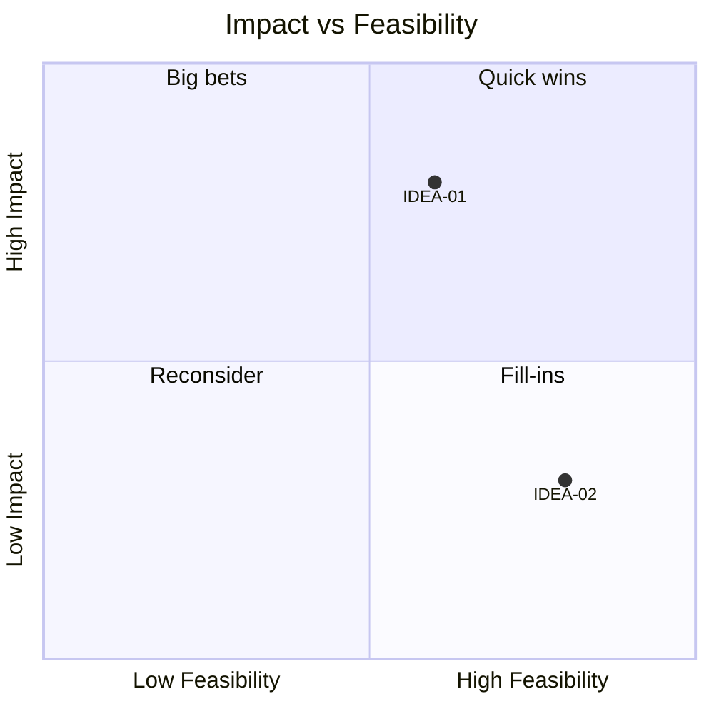
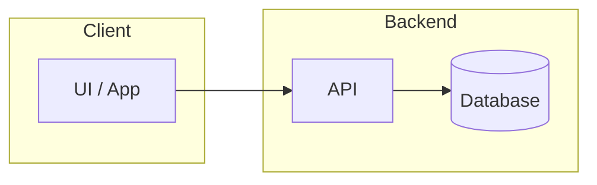
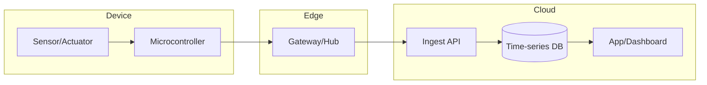
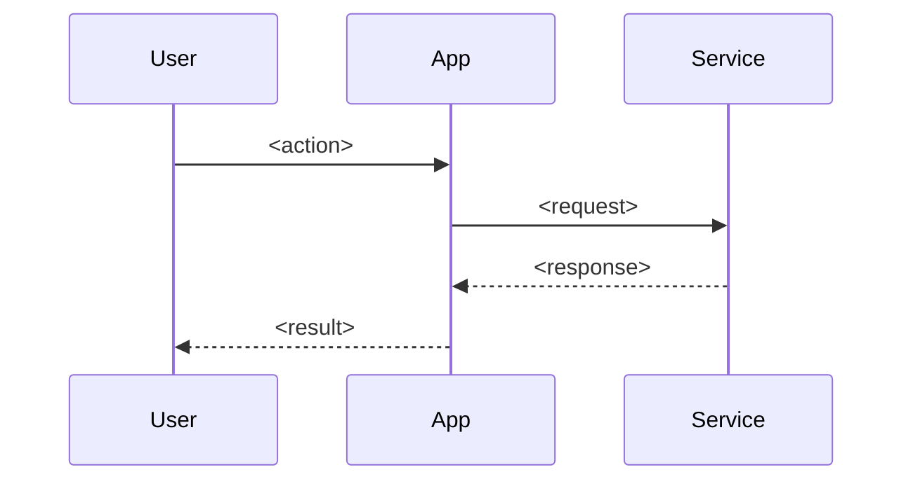

# Writing a Brainstorm Session

A brainstorm session is a self-contained exploration of a problem space, independent
of any run/program. It lives at `brainstorms/<brainstorm-id>/`, not under `runs/`,
and has no `state.json` stage machine — just a divergent pass, one convergent
(critic) pass, and deep-dive briefs for the strongest ideas.

```
brainstorms/<brainstorm-id>/
  session-input.md        ← seed prompt + domain + constraints, verbatim
  concepts.md              ← raw concepts + scoring matrix + prioritization + critic notes
  concept-01-<slug>/
    brief.md                ← deep-dive: problem, architecture, risks, diagrams
  concept-02-<slug>/
    brief.md
  summary.md                ← comparison table + recommendation
```

## ID assignment rules
- Ideas are numbered `IDEA-01`, `IDEA-02`, … in generation order — **write-once**,
  never renumbered, even if later killed by the critic.
- An expand pass (more ideas requested) appends new `IDEA-NN` at the end; existing
  ids are never reused or reassigned.
- A deep-dive concept folder reuses its idea's number: `concept-<NN>-<slug>/`, where
  `<slug>` is a short kebab-case version of the idea's name.

## `session-input.md` format
```markdown
# Session Input
Brainstorm ID: <brainstorm-id>
Captured: <YYYY-MM-DD HH:MM>
Domain: software | iot | hardware | general-engineering | mixed | unspecified
Constraints: <budget / timeline / target users / must-avoid tech, or "none stated">
Concept count requested: <n>

<user's seed prompt, verbatim — do not paraphrase or edit>
```

## `concepts.md` format

```markdown
# Concepts — <brainstorm-id>
Status: draft | scored
Domain: software | iot | hardware | general-engineering | mixed

## Problem space
<one paragraph restating the seed prompt and constraints in plain language; note
any interpretation assumptions made because the prompt was vague>

## Concept map


## Raw concepts

### IDEA-01: <short name (3-6 words)>
**Mechanism:** <how it works, 1-3 sentences>
**Who it's for:** <target user / use case>
**Feasibility flag:** likely | uncertain | stretch

### IDEA-02: <short name>
**Mechanism:** ...
**Who it's for:** ...
**Feasibility flag:** ...

<!-- idea-critic appends everything below this line -->

## Scoring matrix
| Idea | Impact | Feasibility | Cost | Risk | Novelty | Total | Verdict |
|---|---|---|---|---|---|---|---|
| IDEA-01 | 4 | 3 | 2 | 2 | 3 | 6 | shortlisted |
| IDEA-02 | 2 | 4 | 1 | 1 | 2 | 6 | killed — <one-line reason> |

Each dimension is scored 1-5. Impact, Feasibility, and Novelty: higher is better.
Cost and Risk: higher is *worse* (1 = cheap/safe, 5 = expensive/dangerous).
`Total = Impact + Feasibility + Novelty − Cost − Risk`.

## Prioritization

Plot every idea, not just the shortlist. Coordinates are 0-1, derived from each
idea's Feasibility (x) and Impact (y) score on the same 1-5 scale (score / 5).

## Critic notes
**IDEA-01 — shortlisted.** Strongest objection: <the single best reason this could
fail, stated plainly — required even for the top pick>.
**IDEA-02 — killed.** <the concrete failure mode that eliminated it — a constraint
violation, a feasibility blocker, or a dominant duplicate idea>.
```

## Deep-dive brief format (`concept-<NN>-<slug>/brief.md`, written by concept-detailer)

```markdown
# <Concept name> — Deep-dive brief
Brainstorm ID: <brainstorm-id>
Idea ID: IDEA-<NN>
Domain: software | iot | hardware | general-engineering

## Problem & solution
<paragraph — the problem this solves and how, expanded from the raw concept's
mechanism>

## Architecture sketch

For IoT/hardware concepts, tier the flowchart device → edge → cloud → app instead:


## Key flow


## Risks & open questions
- <lead with the critic's Strongest objection from concepts.md — address it, don't drop it>
- <other risks / unknowns>

## Effort estimate
<rough T-shirt size (S/M/L/XL) + one-line rationale — explicitly not a committed estimate>

## Success metrics
- <metric 1>
- <metric 2>
```

## `summary.md` format
```markdown
# Brainstorm summary — <brainstorm-id>
Session: <YYYY-MM-DD>
Concepts generated: <n>  ·  Shortlisted: <m>

## Comparison
| Idea | Total score | One-line pitch | Brief |
|---|---|---|---|
| IDEA-01 | 6 | <pitch> | [concept-01-<slug>/brief.md](concept-01-<slug>/brief.md) |

## Recommendation
<one paragraph — which concept and why, explicitly carrying over its critic-stated
Strongest objection rather than dropping it because it's the recommendation>

## Next step
Reply with an idea id (e.g. "IDEA-01") to hand it off to `/agentic-sdlc:start-run`
as a new program, or describe what to revisit in the brainstorm.
```

## Quality checklist (self-check before finishing)
- [ ] Every idea has a stable, write-once `IDEA-NN` id
- [ ] Concepts span a real range of feasibility flags — not all "likely" (that signals premature filtering)
- [ ] Every scored idea has a Verdict (`shortlisted` or `killed — <reason>`), and every kill/shortlist reason is specific and falsifiable, not a vague adjective
- [ ] Every shortlisted idea has a stated Strongest objection — no idea advances "for free"
- [ ] The quadrant chart plots every idea, not just the shortlist
- [ ] Each deep-dive brief's Risks section leads with the critic's stated objection
- [ ] `concepts.md` Status is "scored" once the critic pass is complete
