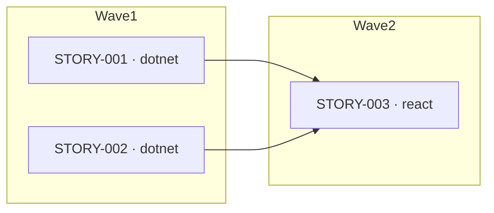

# Writing Stories

The Tech Lead writes a `stories/` **directory**, not a single file:

```
runs/<run-id>/stories/
  index.md          ← overview, execution-plan diagram, story table
  STORY-001.md      ← one self-contained file per story
  STORY-002.md
```

## ID assignment rules
- IDs are STORY-001, STORY-002, ... in definition order.
- IDs are **write-once** — never renumber or reuse.
- When revising: only add new IDs at the end; never delete a story file.

## Track assignment
- `dotnet` track: backend API endpoints, services, data models, DB migrations.
- `react` track: UI components, pages, state management, API calls from the frontend.
- One story belongs to exactly one track. If a feature needs both frontend and
  backend, create two stories (one per track) with the react story listing the
  dotnet story in its `Depends on`.

## Traceability rules
- Every TECH-ID from the tech spec must be covered by at least one story.
- Each story's `Implements` field lists the TECH-IDs it delivers.

## Dependencies and waves
- `Depends on` is the **single source of truth** for ordering.
- A **wave** is a topological layer:
  - Wave 1 = every story whose `Depends on` is empty.
  - Wave N = every story whose dependencies all sit in waves `< N`.
- Compute each story's wave from `Depends on`, then write that wave into both the
  story file's `**Wave:**` field and the index table's `Wave` column.
- The dependency graph MUST be acyclic. A story MUST NOT depend on itself.

## Per-story file format (`STORY-XXX.md`)

```markdown
# STORY-001: <short name (3–6 words)>
Run ID: <run-id>
**Track:** dotnet | react
**Wave:** 1
**Implements:** [TECH-001, TECH-002]
**Depends on:** []
**Estimated complexity:** S | M | L
**Coverage threshold:** {"lines": 80, "critical_paths": 90}

## Description
<what to build — concrete, actionable, enough for an engineer to work without asking questions>

## Acceptance criteria
- <specific, testable criterion (e.g., "GET /api/todos returns 200 with JSON array")>
- <second criterion>
```

## Index format (`index.md`)

The orchestrator parses the `## Story index` table, so its columns are fixed and
in this exact order: `Story | Track | Wave | Depends on | Complexity | File`.
The Mermaid edges are exactly the union of all `Depends on` entries.

````markdown
# Stories — Run <run-id>
Status: draft | approved
Version: <n>

## Execution plan


## Story index
| Story | Track | Wave | Depends on | Complexity | File |
|-------|-------|------|-----------|-----------|------|
| STORY-001 | dotnet | 1 | — | M | [STORY-001.md](STORY-001.md) |
| STORY-002 | dotnet | 1 | — | S | [STORY-002.md](STORY-002.md) |
| STORY-003 | react | 2 | STORY-001, STORY-002 | M | [STORY-003.md](STORY-003.md) |
````

Use `—` in the `Depends on` column for stories with no dependencies.
The `Complexity` column copies each story's `**Estimated complexity:**` value (S | M | L).

## Complexity guidelines
- **S (Small):** Single endpoint or component, no new data model, < 1 hour.
- **M (Medium):** 2–5 endpoints or a full CRUD flow, 1–3 hours.
- **L (Large):** New subsystem, complex state, cross-cutting concern, > 3 hours.

## Quality checklist (self-check before finishing)
- [ ] Every TECH-ID from tech-spec.md appears in at least one story's Implements list
- [ ] Each story belongs to exactly one track (dotnet or react)
- [ ] Acceptance criteria are specific enough to write a failing test for
- [ ] `index.md` exists with the `## Execution plan` diagram and `## Story index` table
- [ ] Every story in the index table has a matching `STORY-XXX.md` file, and vice-versa
- [ ] Each story's `**Wave:**` field matches its `Wave` column in the index
- [ ] Waves are correct: wave 1 has empty `Depends on`; every dependency sits in an earlier wave
- [ ] Mermaid edges equal the union of all `Depends on` fields
- [ ] No dependency cycles; no story depends on itself
- [ ] `index.md` Status is "draft"
